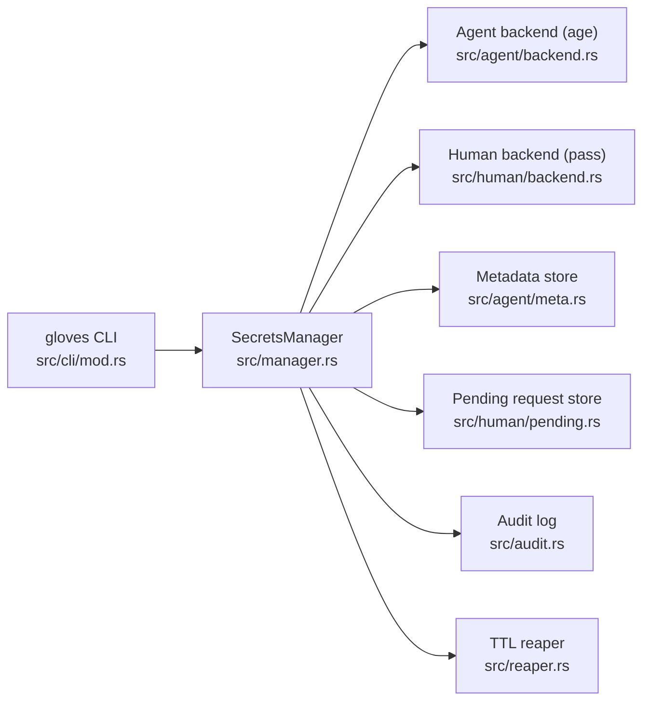
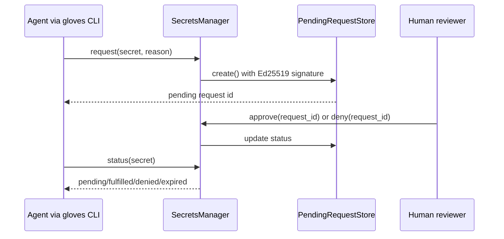

# gloves 🥊🥊
[](https://github.com/heyAyushh/gloves/actions/workflows/ci.yml)
[](https://github.com/heyAyushh/gloves/actions/workflows/test.yml)
[](https://github.com/heyAyushh/gloves/actions/workflows/coverage.yml)
[](https://crates.io/crates/gloves)

`gloves` is a secure secrets control plane for OpenClaw and other multi-agent runtimes with human backend

`gloves` gives one CLI for:
- Agent-owned secrets encrypted with `age`
- Human-owned secrets resolved through `pass`
- Access requests, approvals, metadata, audit trails, and TTL reaping

## Why gloves

- One command surface for both agent and human secret domains
- Secure-by-default storage permissions and atomic writes
- Integrity checks with audit events for sensitive operations
- Explicit request lifecycle for human-gated access
- Rust implementation with comprehensive tests and CI gates

## Installation

### Prerequisites

- Rust stable toolchain (edition 2021)
- `pass` + GPG (required for human-owned secret access)
- Writable secrets root (default: `.openclaw/secrets`)

Quick `pass` install:

```bash
# macOS
brew install pass gnupg

# Ubuntu/Debian
sudo apt-get install pass gnupg
```

### Install from crates.io

```bash
cargo install gloves
```

### Install from source

```bash
git clone https://github.com/openclaw/gloves
cd gloves
cargo install --path .
```

### Install Codex skill

```bash
npx skills add heyAyushh/gloves --skill gloves-cli
```

## Quick Start

```bash
# 1) initialize runtime layout
gloves --root .openclaw/secrets init

# 2) create an agent secret (1 day TTL)
gloves --root .openclaw/secrets set service/token --generate --ttl 1

# 3) inspect state
gloves --root .openclaw/secrets list

# 4) read secret (prints raw value)
gloves --root .openclaw/secrets get service/token
```

## Common Workflows

### Agent secret lifecycle

```bash
# create
gloves --root .openclaw/secrets set app/api-key --stdin --ttl 7

# read
gloves --root .openclaw/secrets get app/api-key

# revoke
gloves --root .openclaw/secrets revoke app/api-key
```

### Human request lifecycle

```bash
# request access to a human-owned secret
gloves --root .openclaw/secrets request prod/db --reason "run migration"

# list pending + metadata
gloves --root .openclaw/secrets list

# resolve request (human action)
gloves --root .openclaw/secrets approve <request-uuid>
# or
gloves --root .openclaw/secrets deny <request-uuid>

# check request status by secret name
gloves --root .openclaw/secrets status prod/db
```

### Verification and cleanup

```bash
# verify state and reap expired secrets
gloves --root .openclaw/secrets verify
```

## Commands

| Command | Purpose | Options / Notes |
|---|---|---|
| `init` | Initialize runtime directories/files | none |
| `set <name>` | Store agent-owned secret | `--generate`, `--stdin`, `--value`, `--ttl <days>` |
| `get <name>` | Retrieve secret value | warns when printing to TTY |
| `env <name> <var>` | Print redacted env export | outputs `export VAR=<REDACTED>` |
| `request <name> --reason <text>` | Create human access request | reason is required |
| `approve <request_id>` | Approve pending request | request UUID |
| `deny <request_id>` | Deny pending request | request UUID |
| `status <name>` | Request status for secret | `pending` / `fulfilled` / `denied` / `expired` |
| `list` | List metadata and pending requests | JSON output |
| `revoke <name>` | Revoke caller-owned secret | removes ciphertext + metadata |
| `verify` | Reap expired items and verify runtime state | logs expiry events |

Full CLI implementation: [`src/cli/mod.rs`](src/cli/mod.rs)

## Runtime Layout

Default root: `.openclaw/secrets`

```text
.openclaw/secrets/
  store/                    # encrypted *.age files
  meta/                     # per-secret metadata JSON
  pending.json              # request lifecycle state
  audit.jsonl               # append-only audit events
  default-agent.agekey      # generated age identity
  default-agent.signing.key # generated Ed25519 signing key
```

Path model: [`SecretsPaths`](src/paths.rs#L5)

## Security Model

- Secret values wrapped in non-`Debug` type: [`SecretValue`](src/types.rs#L103)
- Agent secret encryption and decryption: [`src/agent/backend.rs`](src/agent/backend.rs)
- Human backend via `pass`: [`src/human/backend.rs`](src/human/backend.rs)
- Pending request signature verification: [`src/human/pending.rs`](src/human/pending.rs)
- Restricted file permissions and atomic writes: [`src/fs_secure.rs`](src/fs_secure.rs)
- TTL reaping with audit events: [`TtlReaper::reap`](src/reaper.rs#L16), [`AuditLog::log`](src/audit.rs#L69)

## Agent Memory Exclusions

If another coding agent is installed for this repo, configure memory/indexing excludes:

- `~/.password-store/**` (or `$PASSWORD_STORE_DIR/**`)
- `.openclaw/secrets/**` (or any custom `--root` directory)
- Never persist raw `gloves get` output in memory summaries or notes

## Architecture



### Request flow



## Development

```bash
cargo fmt --all
cargo clippy --all-targets --all-features -- -D warnings
cargo test --all-features
cargo doc --no-deps
```

## Release Channels

- `stable` channel:
  - Branches: `main` and `release/*`
  - Tag format: `vX.Y.Z` (example: `v1.4.0`)
- `beta` channel:
  - Branch: `next`
  - Tag format: `vX.Y.Z-beta.N` (example: `v1.5.0-beta.1`)
- `alpha` channel:
  - Branch: `canary`
  - Tag format: `vX.Y.Z-alpha.N` (example: `v1.5.0-alpha.1`)

Publishing is tag-driven. The publish workflow validates:
- tag format matches one of the channel patterns
- tag version matches `Cargo.toml` package version
- tagged commit belongs to an allowed branch for that channel

Release commands and examples: [`RELEASE.md`](RELEASE.md)

## CI/CD

- [`.github/workflows/ci.yml`](.github/workflows/ci.yml): lint + docs
- [`.github/workflows/test.yml`](.github/workflows/test.yml): full test suite
- [`.github/workflows/coverage.yml`](.github/workflows/coverage.yml): coverage thresholds
- [`.github/workflows/publish.yml`](.github/workflows/publish.yml): publish on matching version tags (requires `CARGO_REGISTRY_TOKEN`)

## License and Changelog

- License: [`LICENSE`](LICENSE)
- Changelog: [`CHANGELOG.md`](CHANGELOG.md)
