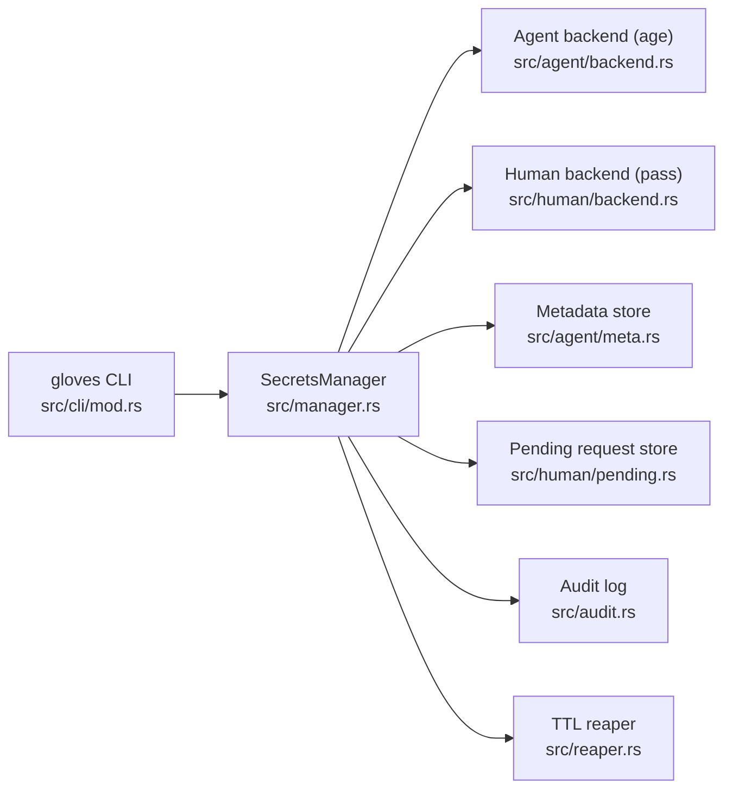
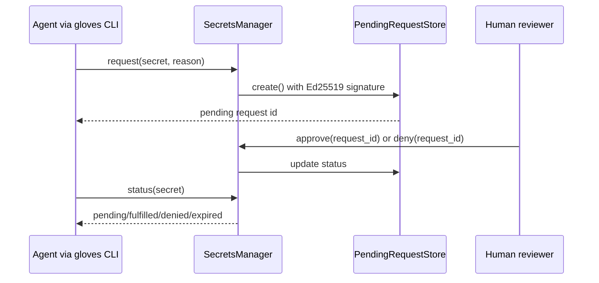

# gloves 🥊🥊
[](https://github.com/heyAyushh/gloves/actions/workflows/ci.yml)
[](https://github.com/heyAyushh/gloves/actions/workflows/test.yml)
[](https://github.com/heyAyushh/gloves/actions/workflows/coverage.yml)
[](https://crates.io/crates/gloves)

`gloves` is a secure secrets control plane for OpenClaw and other multi-agent/human operator runtimes.

- Agent-owned secrets encrypted with `age`
- Human-owned secrets resolved through `pass`
- Access requests, approvals, metadata, audit trails, and TTL reaping

## Why gloves

- One command surface for both agent and human secret domains
- Secure-by-default storage permissions and atomic writes
- Integrity checks with audit events for sensitive operations
- Explicit request lifecycle for human-gated access
- Rust implementation with comprehensive tests and CI gates

## Installation

### Prerequisites

- Rust stable toolchain (edition 2021)
- `pass` + GPG (required for human-owned secret access)
- `gocryptfs` + `fusermount` + `mountpoint` (required for `vault` commands)
- Writable secrets root (default: `.openclaw/secrets`)

Quick `pass` install:

```bash
# macOS
brew install pass gnupg

# Ubuntu/Debian
sudo apt-get install pass gnupg
```

### Install from crates.io

```bash
cargo install gloves
```

### Install from source

```bash
git clone https://github.com/openclaw/gloves
cd gloves
cargo install --path .
```

### Install Agent skill

```bash
npx skills add heyAyushh/gloves --skill gloves-cli
```

## Quick Start

```bash
# 1) initialize runtime layout
gloves --root .openclaw/secrets init

# 2) create an agent secret (1 day TTL)
gloves --root .openclaw/secrets set service/token --generate --ttl 1

# 3) inspect state
gloves --root .openclaw/secrets list

# 4) read secret (prints raw value)
gloves --root .openclaw/secrets get service/token
```

## Common Workflows

### Agent secret lifecycle

```bash
# create
gloves --root .openclaw/secrets set app/api-key --stdin --ttl 7

# read
gloves --root .openclaw/secrets get app/api-key

# revoke
gloves --root .openclaw/secrets revoke app/api-key
```

### Human request lifecycle

```bash
# request access to a human-owned secret
gloves --root .openclaw/secrets request prod/db --reason "run migration"

# list pending + metadata
gloves --root .openclaw/secrets list

# resolve request (human action)
gloves --root .openclaw/secrets approve <request-uuid>
# or
gloves --root .openclaw/secrets deny <request-uuid>

# check request status by secret name
gloves --root .openclaw/secrets status prod/db
```

### Verification and cleanup

```bash
# verify state and reap expired secrets
gloves --root .openclaw/secrets verify
```

### Encrypted vault lifecycle

```bash
# initialize a vault
gloves --root .openclaw/secrets vault init agent_data --owner agent
gloves --root .openclaw/secrets vault init personal --owner human

# mount with TTL
gloves --root .openclaw/secrets vault mount agent_data --ttl 1h

# trusted handoff prompt (request file from trusted mounted agent)
gloves --root .openclaw/secrets vault ask-file agent_data \
  --file docs/notes.txt \
  --requester agent-a \
  --trusted-agent agent-b

# unmount / inspect
gloves --root .openclaw/secrets vault unmount agent_data
gloves --root .openclaw/secrets vault status
gloves --root .openclaw/secrets vault list
```

### Sidecar daemon (systemd-friendly TCP)

```bash
# strict startup checks (permissions + loopback bind policy + bind availability)
gloves --root .openclaw/secrets daemon --check --bind 127.0.0.1:7788

# start local daemon on loopback TCP
gloves --root .openclaw/secrets daemon --bind 127.0.0.1:7788
```

Set OpenClaw sidecar endpoint to the exact same address and port as `--bind`.

For OpenClaw process supervisors (for example `systemd` or `qmd`), run the same daemon command with restart policy enabled.

### systemd (recommended for OpenClaw)

Install unit files from [`systemd/`](systemd):

```bash
# user-level units
mkdir -p ~/.config/systemd/user
cp systemd/glovesd.service ~/.config/systemd/user/
cp systemd/gloves-verify.service ~/.config/systemd/user/
cp systemd/gloves-verify.timer ~/.config/systemd/user/

systemctl --user daemon-reload
systemctl --user enable --now glovesd.service
systemctl --user enable --now gloves-verify.timer
```

If your `gloves` binary is not in `~/.cargo/bin/gloves`, edit `ExecStart` and `ExecStartPre` in the copied unit files.

## Commands

| Command | Purpose | Options / Notes |
|---|---|---|
| `init` | Initialize runtime directories/files | none |
| `set <name>` | Store agent-owned secret | `--generate`, `--stdin`, `--value`, `--ttl <days>` (`days > 0`) |
| `get <name>` | Retrieve secret value | warns when printing to TTY |
| `env <name> <var>` | Print redacted env export | outputs `export VAR=<REDACTED>` |
| `request <name> --reason <text>` | Create human access request | reason is required |
| `approve <request_id>` | Approve pending request | request UUID |
| `deny <request_id>` | Deny pending request | request UUID |
| `status <name>` | Request status for secret | `pending` / `fulfilled` / `denied` / `expired` |
| `list` | List metadata and pending requests | JSON output |
| `revoke <name>` | Revoke caller-owned secret | removes ciphertext + metadata |
| `verify` | Reap expired items and verify runtime state | logs expiry events |
| `daemon` | Run local sidecar daemon | loopback TCP only (`--bind`, default `127.0.0.1:7788`) |
| `vault init <name> --owner <agent|human>` | Create encrypted vault metadata + ciphertext dir | `agent` owner auto-generates vault secret |
| `vault mount <name>` | Mount encrypted vault with TTL session | `--ttl <duration>`, `--mountpoint`, `--agent` |
| `vault unmount <name>` | Unmount vault and clear session | `--agent` |
| `vault status` | Show mounted/locked status and remaining TTL | JSON output |
| `vault list` | List configured vaults | JSON output |
| `vault ask-file <name>` | Generate trusted-agent handoff prompt for one file | `--file`, `--requester`, `--trusted-agent`, `--reason` |

Full CLI implementation: [`src/cli/mod.rs`](src/cli/mod.rs)
Bootstrap config spec: [`GLOVES_CONFIG_SPEC.md`](GLOVES_CONFIG_SPEC.md)
Bootstrap config parser module: [`src/config.rs`](src/config.rs)

## Bootstrap Config Parser (Library)

`gloves` now includes a production parser/validator for `.gloves.toml`:

- Config schema parsing with unknown-field rejection
- Discovery and precedence resolution (`flag`, `env`, `discovered`, `none`)
- Path normalization and `~` expansion handling
- Daemon/defaults/agent policy validation
- Unix file permission checks and symlink rejection for config files

Current status:

- Implemented as library API in [`src/config.rs`](src/config.rs)
- CLI bootstrap flags/subcommands from the spec are not wired yet

Example usage from Rust:

```rust
use gloves::config::{resolve_config_path, GlovesConfig};

let cwd = std::env::current_dir()?;
let selection = resolve_config_path(None, std::env::var("GLOVES_CONFIG").ok().as_deref(), false, &cwd)?;
if let Some(path) = selection.path {
    let config = GlovesConfig::load_from_path(path)?;
    println!("effective root: {}", config.root.display());
}
# Ok::<(), gloves::error::GlovesError>(())
```

## Runtime Layout

Default root: `.openclaw/secrets`

```text
.openclaw/secrets/
  store/                    # encrypted *.age files
  meta/                     # per-secret metadata JSON
  vaults/                   # per-vault config + sessions JSON
  encrypted/                # vault ciphertext directories
  mnt/                      # default vault mountpoints
  pending.json              # request lifecycle state
  audit.jsonl               # append-only audit events
  default-agent.agekey      # generated age identity
  default-agent.signing.key # generated Ed25519 signing key
```

Path model: [`SecretsPaths`](src/paths.rs#L5)

## Security Model

- Secret values wrapped in non-`Debug` type: [`SecretValue`](src/types.rs#L103)
- Agent secret encryption and decryption: [`src/agent/backend.rs`](src/agent/backend.rs)
- Human backend via `pass`: [`src/human/backend.rs`](src/human/backend.rs)
- Vault orchestration via `gocryptfs`: [`src/vault/`](src/vault/)
- Bootstrap config parsing and validation: [`src/config.rs`](src/config.rs)
- Pending request signature verification: [`src/human/pending.rs`](src/human/pending.rs)
- Restricted file permissions and atomic writes: [`src/fs_secure.rs`](src/fs_secure.rs)
- TTL reaping with audit events: [`TtlReaper::reap`](src/reaper.rs#L16), [`AuditLog::log`](src/audit.rs#L69)

## Agent Memory Exclusions

If another coding agent is installed for this repo, configure memory/indexing excludes:

- `~/.password-store/**` (or `$PASSWORD_STORE_DIR/**`)
- `.openclaw/secrets/**` (or any custom `--root` directory)
- Never persist raw `gloves get` output in memory summaries or notes

## Architecture



### Request flow



## Development

```bash
cargo fmt --all
cargo clippy --all-targets --all-features -- -D warnings
cargo test --all-features
cargo doc --no-deps
```

## Release Channels

- `stable` channel:
  - Branches: `main` and `release/*`
  - Tag format: `vX.Y.Z` (example: `v1.4.0`)
- `beta` channel:
  - Branch: `next`
  - Tag format: `vX.Y.Z-beta.N` (example: `v1.5.0-beta.1`)
- `alpha` channel:
  - Branch: `canary`
  - Tag format: `vX.Y.Z-alpha.N` (example: `v1.5.0-alpha.1`)

Publishing is tag-driven. The publish workflow validates:
- tag format matches one of the channel patterns
- tag version matches `Cargo.toml` package version
- tagged commit belongs to an allowed branch for that channel

Release commands and examples: [`RELEASE.md`](RELEASE.md)

## CI/CD

- [`.github/workflows/ci.yml`](.github/workflows/ci.yml): lint + docs
- [`.github/workflows/test.yml`](.github/workflows/test.yml): full test suite
- [`.github/workflows/coverage.yml`](.github/workflows/coverage.yml): coverage thresholds
- [`.github/workflows/publish.yml`](.github/workflows/publish.yml): publish on matching version tags (requires `CARGO_REGISTRY_TOKEN`)

## License and Changelog

- License: [`LICENSE`](LICENSE)
- Changelog: [`CHANGELOG.md`](CHANGELOG.md)
