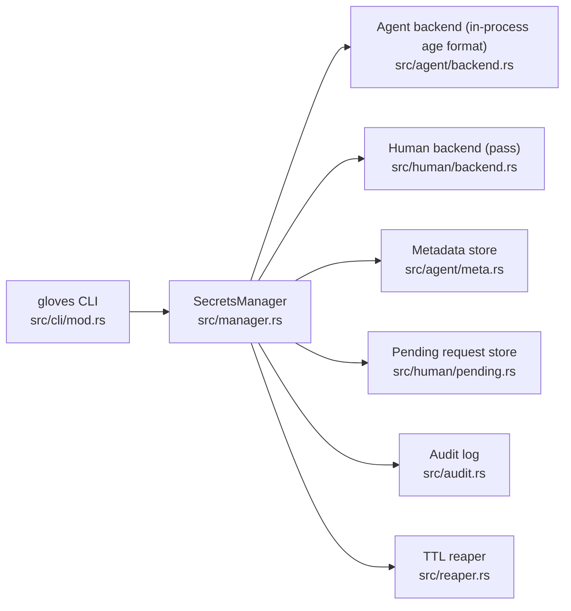

# gloves 🥊🥊
[](https://github.com/heyAyushh/gloves/actions/workflows/ci.yml)
[](https://github.com/heyAyushh/gloves/actions/workflows/test.yml)
[](https://github.com/heyAyushh/gloves/actions/workflows/coverage.yml)
[](https://crates.io/crates/gloves)

> Experimental: this project is currently in experimental mode. Interfaces and behavior may change between releases.

`gloves` is a secure secrets control plane for OpenClaw and other multi-agent/human operator runtimes.

- Agent-owned secrets encrypted in-process via the [`rage`](https://github.com/str4d/rage) project (`age` format)
- Human-owned secrets resolved through [`pass`](https://www.passwordstore.org/)
- Access requests, approvals, metadata, audit trails, and TTL reaping

## Why gloves

- One command surface for both agent and human secret domains
- Secure-by-default storage permissions and atomic writes
- Integrity checks with audit events for sensitive operations
- Explicit request lifecycle for human-gated access
- Rust implementation with comprehensive tests and CI gates

## Installation

### Prerequisites

- `curl` + `tar` (for release-binary installs)
- Rust stable toolchain (edition 2021, only for source builds)
- In-process crypto library from [`rage`](https://github.com/str4d/rage) (`age` crate, no external crypto binary required)
- [`pass`](https://www.passwordstore.org/) + GPG (required for human-owned secret access)
- `gocryptfs` + `fusermount` + `mountpoint` (required for `vault` commands)
- Writable secrets root (default: `.openclaw/secrets`)

Quick [`pass`](https://www.passwordstore.org/) install:

```bash
# macOS
brew install pass gnupg

# Ubuntu/Debian
sudo apt-get install pass gnupg
```

### Install from GitHub release binaries (recommended)

This script installs:

- prebuilt `gloves` CLI from GitHub Releases (no local build)
- `skills/gloves-cli-usage` into `~/.openclaw/skills/gloves-cli-usage`
- `skills/gloves-setup-migrate` into `~/.openclaw/skills/gloves-setup-migrate`
- initialized secrets root at `~/.openclaw/secrets`

```bash
curl -fsSL https://raw.githubusercontent.com/openclaw/gloves/main/scripts/setup-openclaw.sh | bash
```

Pin a specific release:

```bash
curl -fsSL https://raw.githubusercontent.com/openclaw/gloves/main/scripts/setup-openclaw.sh | bash -s -- --release-ref vX.Y.Z
```

### Install from crates.io

```bash
cargo install gloves
```

### Install from source

```bash
git clone https://github.com/openclaw/gloves
cd gloves
cargo install --path .
```

### Install Agent skills

```bash
npx skills add heyAyushh/gloves --skill gloves-cli-usage
npx skills add heyAyushh/gloves --skill gloves-setup-migrate
```

### OpenClaw setup script (CLI + skill)

Run this repository script to:

- install `gloves` from GitHub Releases (default `--install-mode release`)
- install both skill directories to `~/.openclaw/skills/`:
  - `gloves-cli-usage`
  - `gloves-setup-migrate`
- initialize `~/.openclaw/secrets` with `gloves --root ... init`

```bash
curl -fsSL https://raw.githubusercontent.com/openclaw/gloves/main/scripts/setup-openclaw.sh | bash
```

Useful options:

- `--install-mode <release|source>`: choose release binary (default) or local source build
- `--release-ref <latest|vX.Y.Z>`: choose release version for binary install
- `--repo <OWNER/REPO>`: override GitHub repo used for release/skill downloads
- `--repo-root <PATH>`: use local repository for source install and/or local skill copy
- `--skill-ref <REF>`: fetch skill files from a specific tag/branch when local skill files are unavailable
- `--dry-run`: preview commands without applying changes
- `--skip-cli-install`: only install skill files and init root
- `--skip-init`: skip `gloves --root <PATH> init`
- `--secrets-root <PATH>`: override default secrets root
- `--skills-dest <PATH>`: override destination root for installed skill directories
- `--skill-dest <PATH>`: deprecated alias for `--skills-dest`

Each tagged release now includes these installable assets:

- `gloves-<version>-x86_64-unknown-linux-gnu.tar.gz`
- `gloves-<version>-x86_64-apple-darwin.tar.gz`
- `gloves-<version>-aarch64-apple-darwin.tar.gz`
- `gloves-<version>-x86_64-pc-windows-msvc.zip`
- `checksums.txt`

## Quick Start

```bash
# 1) initialize runtime layout
gloves --root .openclaw/secrets init

# 2) create an agent secret (1 day TTL)
gloves --root .openclaw/secrets set service/token --generate --ttl 1

# 3) inspect state
gloves --root .openclaw/secrets list

# 4) read secret (prints raw value)
gloves --root .openclaw/secrets get service/token
```

## Multi-Agent VM Operations Guide

For production-style virtual machine deployments with multiple agents and human operators, use:

- [`docs/vm-multi-agent-human-guide.md`](docs/vm-multi-agent-human-guide.md)
- [`docs/security-hardening.md`](docs/security-hardening.md)
- [`docs/release-binaries.md`](docs/release-binaries.md)

## Common Workflows

### Agent secret lifecycle

```bash
# create
gloves --root .openclaw/secrets set app/api-key --stdin --ttl 7

# read
gloves --root .openclaw/secrets get app/api-key

# revoke
gloves --root .openclaw/secrets revoke app/api-key
```

### Human request lifecycle

```bash
# request access to a human-owned secret
gloves --root .openclaw/secrets request prod/db --reason "run migration"

# list pending + metadata
gloves --root .openclaw/secrets list

# resolve request (human action)
gloves --root .openclaw/secrets approve <request-uuid>
# or
gloves --root .openclaw/secrets deny <request-uuid>

# check request status by secret name
gloves --root .openclaw/secrets status prod/db
```

### Verification and cleanup

```bash
# verify state and reap expired secrets
gloves --root .openclaw/secrets verify
```

### Encrypted vault lifecycle

```bash
# initialize a vault
gloves --root .openclaw/secrets vault init agent_data --owner agent
gloves --root .openclaw/secrets vault init personal --owner human

# mount with TTL
gloves --root .openclaw/secrets vault mount agent_data --ttl 1h

# mount, execute, and unmount automatically
gloves --root .openclaw/secrets vault exec agent_data -- \
  sh -c 'ls -la ~/.openclaw/vault/agent_data'

# trusted handoff prompt (request file from trusted mounted agent)
gloves --root .openclaw/secrets vault ask-file agent_data \
  --file docs/notes.txt \
  --requester agent-a \
  --trusted-agent agent-b

# unmount / inspect
gloves --root .openclaw/secrets vault unmount agent_data
gloves --root .openclaw/secrets vault status
gloves --root .openclaw/secrets vault list
```

### Sidecar daemon (systemd-friendly TCP)

```bash
# strict startup checks (permissions + loopback bind policy + bind availability)
gloves --root .openclaw/secrets daemon --check --bind 127.0.0.1:7788

# start local daemon on loopback TCP
gloves --root .openclaw/secrets daemon --bind 127.0.0.1:7788
```

Set OpenClaw sidecar endpoint to the exact same address and port as `--bind`.

For OpenClaw process supervisors (for example `systemd` or `qmd`), run the same daemon command with restart policy enabled.

### systemd (recommended for OpenClaw)

Install unit files from [`systemd/`](systemd):

```bash
# user-level units
mkdir -p ~/.config/systemd/user
cp systemd/glovesd.service ~/.config/systemd/user/
cp systemd/gloves-verify.service ~/.config/systemd/user/
cp systemd/gloves-verify.timer ~/.config/systemd/user/

systemctl --user daemon-reload
systemctl --user enable --now glovesd.service
systemctl --user enable --now gloves-verify.timer
```

If your `gloves` binary is not in `~/.cargo/bin/gloves`, edit `ExecStart` and `ExecStartPre` in the copied unit files.

## Commands

| Command | Purpose | Options / Notes |
|---|---|---|
| `init` | Initialize runtime directories/files | none |
| `set <name>` | Store agent-owned secret | `--generate`, `--stdin`, `--value`, `--ttl <days>` (`days > 0`) |
| `get <name>` | Retrieve secret value | `--pipe-to <command>` streams bytes to stdin; `--pipe-to-args "<command> {secret}"` interpolates UTF-8 secrets into args; executable must be in `GLOVES_GET_PIPE_ALLOWLIST`; optional `GLOVES_GET_PIPE_ARG_POLICY` (exact templates) and `.gloves.toml [secrets.pipe.commands.<command>]` (URL prefixes) can tighten `--pipe-to-args`; warns on TTY |
| `env <name> <var>` | Print redacted env export | outputs `export VAR=<REDACTED>` |
| `request <name> --reason <text>` | Create human access request | optional `--allowlist` and `--blocklist` accept `*`, `namespace/*`, exact id |
| `approve <request_id>` | Approve pending request | request UUID; returns JSON review payload |
| `deny <request_id>` | Deny pending request | request UUID; returns JSON review payload |
| `status <name>` | Request status for secret | `pending` / `fulfilled` / `denied` / `expired` |
| `list` | List metadata and pending requests | `--pending` filters to pending request entries |
| `audit` | View audit trail entries | `--limit <n>` (default 50), `--json` for structured output |
| `revoke <name>` | Revoke caller-owned secret | removes ciphertext + metadata |
| `verify` | Reap expired items and verify runtime state | logs expiry events |
| `daemon` | Run local sidecar daemon | loopback TCP only (`--bind`, default `127.0.0.1:7788`) |
| `vault init <name> --owner <agent|human>` | Create encrypted vault metadata + ciphertext dir | `agent` owner auto-generates vault secret |
| `vault mount <name>` | Mount encrypted vault with TTL session | `--ttl <duration>`, `--mountpoint`, `--agent` |
| `vault exec <name> -- <command...>` | Mount vault, run command, then unmount | supports `--ttl`, `--mountpoint`, `--agent`; returns wrapped command exit code; strips extpass env vars from wrapped command |
| `vault unmount <name>` | Unmount vault and clear session | `--agent` |
| `vault status` | Show mounted/locked status and remaining TTL | JSON output |
| `vault list` | List configured vaults | JSON output |
| `vault ask-file <name>` | Generate trusted-agent handoff prompt for one file | `--file`, `--requester`, `--trusted-agent`, `--reason` |
| `config validate` | Validate effective bootstrap config | honors `--config`, `--no-config`, `GLOVES_CONFIG`; checks vault deps when mode is `required` |
| `access paths --agent <id>` | Show one agent's configured private path visibility | add `--json` for machine-readable output |
| `gpg create` | Create a per-agent GPG key when missing | idempotent; prints JSON with `fingerprint` and `created` |
| `gpg fingerprint` | Show per-agent GPG key fingerprint | fails with `not found` when no key exists |

Global flags:

- `--root <PATH>`: override runtime root.
- `--agent <ID>`: override the caller agent id for one invocation.
- `--config <PATH>`: use one config file.
- `--no-config`: disable config loading/discovery.
- `--vault-mode <auto|required|disabled>`: override vault runtime mode for one invocation.

Environment variables:

- `GLOVES_GET_PIPE_ALLOWLIST`: comma-separated executable names allowed by `gloves get --pipe-to` and `--pipe-to-args`.
- `GLOVES_GET_PIPE_ARG_POLICY`: optional JSON map of executable to exact allowed `--pipe-to-args` templates.
  Example: `{"curl":["curl -u ayush:{secret} http://127.0.0.1:4001/carddav/principal/ayush/"]}`
- `GLOVES_GET_PIPE_URL_POLICY`: optional JSON map of executable to allowed URL prefixes for `--pipe-to-args` (env fallback when config does not define command URL policy).
  Example: `{"curl":["https://api.example.com/v1/","http://127.0.0.1:4001/carddav/"]}`
- `GLOVES_REQUEST_ALLOWLIST`: optional comma-separated request allowlist patterns (`*`, `namespace/*`, exact id).
- `GLOVES_REQUEST_BLOCKLIST`: optional comma-separated request blocklist patterns (`*`, `namespace/*`, exact id).

Config-managed URL policy for `--pipe-to-args`:

```toml
[secrets.pipe.commands.curl]
require_url = true
url_prefixes = ["https://api.example.com/v1/"]

[secrets.pipe.commands.wget]
require_url = true
url_prefixes = ["https://downloads.example.com/"]
```

When a command has a config policy entry:

- URL args in `--pipe-to-args` must match one allowed prefix.
- `require_url = true` requires at least one URL argument in the template.
- The rule applies to any configured executable name, not only `curl`/`wget`.
- Prefix matching is strict by scheme + authority + path-segment boundary (for example `/v1` does not match `/v10`).
- Prefixes must not include query (`?`) or fragment (`#`) components.
- URL policy scopes only URL arguments; non-URL flags and payload arguments remain flexible.

Policy selection guide:

- Executable-only guard: `GLOVES_GET_PIPE_ALLOWLIST` (lowest friction, broadest risk envelope).
- URL-scoped guard: `.gloves.toml [secrets.pipe.commands.<command>]` with `require_url = true` (same URLs allowed with varying payload/flags).
- Exact template guard: `GLOVES_GET_PIPE_ARG_POLICY` (strictest; safest for high-risk commands).

Security notes:

- `--pipe-to-args` only accepts UTF-8 secrets without control characters; use `--pipe-to` for raw byte-safe forwarding.
- Use `GLOVES_GET_PIPE_ARG_POLICY` for high-risk tools (for example `curl`) so only exact approved argument templates are permitted.
- Prefer `.gloves.toml [secrets.pipe.commands.<command>]` for URL-scoped policy in shared environments; use `GLOVES_GET_PIPE_URL_POLICY` as a compatibility fallback.
- `vault exec` removes `GLOVES_EXTPASS_ROOT` and `GLOVES_EXTPASS_AGENT` from wrapped command env.
- Keep allowlists narrow and prefer stdin-based secret piping when possible.

Audit quick view:

```bash
gloves audit --limit 25
gloves audit --json --limit 200
```

`audit --limit` gives a human-readable stream; `audit --json` is suited for automation and SIEM ingestion.

Secret ACL operations map:

- `read`: `gloves get`
- `write`: `gloves set`
- `list`: `gloves list` (plus list filtering by path)
- `revoke`: `gloves revoke`
- `request`: `gloves request`
- `status`: `gloves status`
- `approve`: `gloves approve`
- `deny`: `gloves deny`

Comprehensive secret ACL example (`.gloves.toml`):

```toml
[secrets.acl.agent-main]
paths = ["github/*", "shared/*"]
operations = ["read", "write", "list", "revoke", "request", "status", "approve", "deny"]

[secrets.acl.agent-relationships]
paths = ["contacts/*", "shared/contacts/*"]
operations = ["read", "write", "list", "request", "status"]

[secrets.acl.agent-workflows]
paths = ["workflows/*", "shared/webhooks/*"]
operations = ["read", "write", "list", "request", "status", "approve", "deny"]
```

When `[secrets.acl]` is present, only listed agents/operations/path patterns are allowed.
Path pattern forms:

- `"*"`: all secrets
- `"namespace/*"`: all secrets in one namespace
- `"namespace/secret-name"`: one exact secret

Full CLI implementation: [`src/cli/mod.rs`](src/cli/mod.rs)
Bootstrap config spec: [`GLOVES_CONFIG_SPEC.md`](GLOVES_CONFIG_SPEC.md)
Bootstrap config parser module: [`src/config.rs`](src/config.rs)

## Bootstrap Config Parser (Library)

`gloves` now includes a production parser/validator for `.gloves.toml`:

- Config schema parsing with unknown-field rejection
- Discovery and precedence resolution (`flag`, `env`, `discovered`, `none`)
- Path normalization and `~` expansion handling
- Daemon/defaults/agent policy validation
- Unix file permission checks and symlink rejection for config files

Current status:

- Implemented as library API in [`src/config.rs`](src/config.rs)
- CLI runtime wiring implemented in [`src/cli/commands.rs`](src/cli/commands.rs)
- `gloves config validate` and `gloves access paths` are available
- Vault mode enforcement (`auto` / `required` / `disabled`) is active

Example usage from Rust:

```rust
use gloves::config::{resolve_config_path, GlovesConfig};

let cwd = std::env::current_dir()?;
let selection = resolve_config_path(None, std::env::var("GLOVES_CONFIG").ok().as_deref(), false, &cwd)?;
if let Some(path) = selection.path {
    let config = GlovesConfig::load_from_path(path)?;
    println!("effective root: {}", config.root.display());
}
# Ok::<(), gloves::error::GlovesError>(())
```

## Runtime Layout

Default root: `.openclaw/secrets`

```text
.openclaw/secrets/
  store/                    # encrypted *.age files
  meta/                     # per-secret metadata JSON
  gpg/                      # per-agent GPG homedirs
  vaults/                   # per-vault config + sessions JSON
  encrypted/                # vault ciphertext directories
  mnt/                      # default vault mountpoints
  pending.json              # request lifecycle state
  audit.jsonl               # append-only audit events
  default-agent.agekey      # generated age identity (rage project format)
  default-agent.signing.key # generated Ed25519 signing key
```

Path model: [`SecretsPaths`](src/paths.rs#L5)

## Security Model

- Secret values wrapped in non-`Debug` type: [`SecretValue`](src/types.rs#L103)
- Agent secret encryption and decryption: [`src/agent/backend.rs`](src/agent/backend.rs)
- Human backend via `pass`: [`src/human/backend.rs`](src/human/backend.rs)
- Vault orchestration via `gocryptfs`: [`src/vault/`](src/vault/)
- Bootstrap config parsing and validation: [`src/config.rs`](src/config.rs)
- Pending request signature verification: [`src/human/pending.rs`](src/human/pending.rs)
- Restricted file permissions and atomic writes: [`src/fs_secure.rs`](src/fs_secure.rs)
- TTL reaping with audit events: [`TtlReaper::reap`](src/reaper.rs#L16), [`AuditLog::log`](src/audit.rs#L69)

## Agent Memory Exclusions

If another coding agent is installed for this repo, configure memory/indexing excludes:

- `~/.password-store/**` (or `$PASSWORD_STORE_DIR/**`)
- `.openclaw/secrets/**` (or any custom `--root` directory)
- Never persist raw `gloves get` output in memory summaries or notes

## Architecture



### Request flow


## Development

```bash
cargo fmt --all
cargo clippy --all-targets --all-features -- -D warnings
cargo test --all-features
cargo doc --no-deps
```

## Release Channels

- `stable` channel:
  - Branches: `main` and `release/*`
  - Tag format: `vX.Y.Z` (example: `v1.4.0`)
- `beta` channel:
  - Branch: `next`
  - Tag format: `vX.Y.Z-beta.N` (example: `v1.5.0-beta.1`)
- `alpha` channel:
  - Branch: `canary`
  - Tag format: `vX.Y.Z-alpha.N` (example: `v1.5.0-alpha.1`)

Publishing is tag-driven. The publish workflow validates:
- tag format matches one of the channel patterns
- tag version matches `Cargo.toml` package version
- tagged commit belongs to an allowed branch for that channel

Release commands and examples: [`RELEASE.md`](RELEASE.md)

## CI/CD

- [`.github/workflows/ci.yml`](.github/workflows/ci.yml): lint + docs
- [`.github/workflows/test.yml`](.github/workflows/test.yml): full test suite
- [`.github/workflows/coverage.yml`](.github/workflows/coverage.yml): coverage thresholds
- [`.github/workflows/publish.yml`](.github/workflows/publish.yml): publish on matching version tags (requires `CARGO_REGISTRY_TOKEN`)

## License and Changelog

- License: [`LICENSE`](LICENSE)
- Changelog: [`CHANGELOG.md`](CHANGELOG.md)
