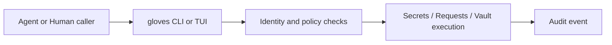

# Concepts and Parts

This guide explains the runtime model for `gloves`.

## Core Concepts

- Secret: value addressed by an id such as `service/token`.
- Secret owner:
  - `agent`: encrypted and managed by `gloves`.
  - `human`: source of truth stays in `pass`; access is request-gated.
- Agent: caller identity for CLI actions (`--agent <id>`).
- Default agent: fallback caller id (`default-agent`) when `--agent` is not supplied.
- Request: pending approval for human-owned secret access.
- Approval: human decision on a request (`approve` or `deny`).
- Grant: explicit sharing of an existing agent-owned secret with another agent.
- Audit event: immutable event record for operations and security-significant actions.
- Vault: encrypted filesystem workflow (`vault init/mount/exec/unmount`).
- Daemon: loopback TCP sidecar exposing command execution API.

## Runtime Parts

| Part | Purpose |
|---|---|
| `store/` | Encrypted secret payloads |
| `meta/` | Secret metadata and ownership |
| `pending.json` | Request/approval state |
| `audit.jsonl` | Append-only audit log |
| `gpg/` | Per-agent GPG home directories |
| `vaults/` | Vault metadata and mount sessions |
| `encrypted/` | Vault ciphertext directories |
| `mnt/` | Vault mountpoints |

Default root is `.openclaw/secrets` unless overridden with `--root` or config.

## Identity Model

- Use explicit `--agent` in automation and production runbooks.
- Use stable agent ids (`agent-main`, `agent-workflows`, `human-ops`).
- Keep the default agent only for local development convenience.

## Command Families

- Secret operations: `gloves secrets ...`
- Human request creation: `gloves request ...`
- Human request review: `gloves requests ...`
- Vault operations: `gloves vault ...`
- GPG operations: `gloves gpg ...`
- Interactive operation: `gloves tui`

## Lifecycle Overview

## Next Reading

- [Quickstart](quickstart.md)
- [Secrets and Requests](secrets-and-requests.md)
- [Humans, Agents, and GPG](humans-agents-and-gpg.md)
- [Configuration Guide](configuration.md)
