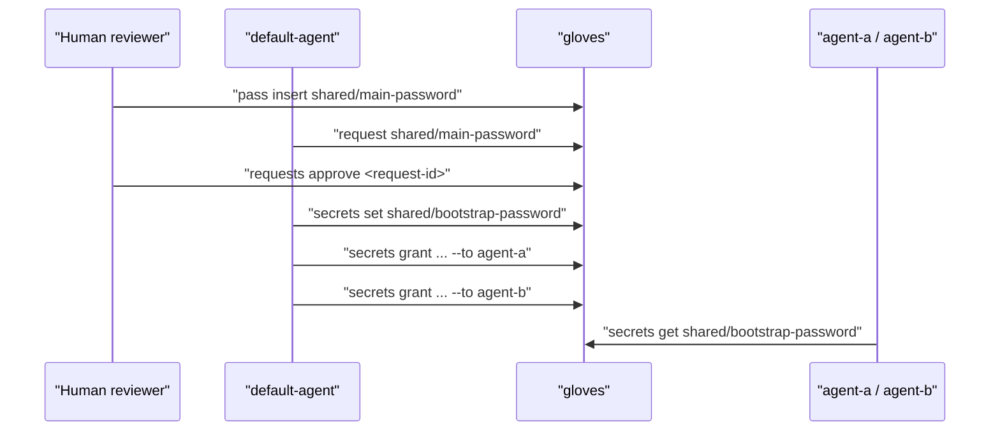

# Humans, Agents, and GPG

This guide explains identity boundaries and recommended workflow between humans and agents.

## Human vs Agent

- Agent identity: runtime caller id (`--agent <id>`) used for policy and audit.
- Human role: reviewer/operator who approves or denies access requests.
- Default agent: `default-agent` when `--agent` is omitted.

Recommended production pattern:

- Always pass explicit `--agent`.
- Reserve a small set of human reviewer identities (`human-ops`, `human-security`).
- Keep least-privilege access per identity in config.

## GPG Responsibilities

`gloves gpg` manages per-agent GPG keys used in human secret workflows.

Initialize key for one identity:

```bash
gloves --agent human-ops gpg create
gloves --agent human-ops gpg fingerprint
```

Repeat for each reviewer identity that will handle human workflows.

## Workflow: Human Provides Main Password, Agents Consume Safely

This is the pattern you described (human seed -> default agent -> other agents):

1. Human stores canonical secret in `pass`.
2. Default agent requests access using `gloves request`.
3. Human approves via `gloves requests approve`.
4. Default agent reads and re-publishes as agent-owned secret (`gloves secrets set ...`).
5. Default agent grants to specific agents (`gloves secrets grant ... --to ...`).

Example:

```bash
# human stores secret in pass
pass insert shared/main-password

# default agent requests human approval
gloves --agent default-agent request shared/main-password --reason "bootstrap downstream agents"

# human approves
gloves --agent human-ops requests list
gloves --agent human-ops requests approve <request-id>

# default agent creates agent-owned copy and grants it
gloves --agent default-agent secrets get shared/main-password | \
  gloves --agent default-agent secrets set shared/bootstrap-password --stdin --ttl 1

gloves --agent default-agent secrets grant shared/bootstrap-password --to agent-a
gloves --agent default-agent secrets grant shared/bootstrap-password --to agent-b
```

## Sequence Diagram



## Security Notes

- Do not leave secrets in shell history; prefer `--stdin` or `--generate`.
- Use short TTL for bootstrap secrets.
- Grant only to required agents.
- Rotate and revoke after bootstrap if the value is temporary.

## Related Docs

- [Secrets and Requests](secrets-and-requests.md)
- [Configuration Guide](configuration.md)
- [Security Hardening](security-hardening.md)
- [VM Multi-Agent Operations](vm-multi-agent-human-guide.md)
